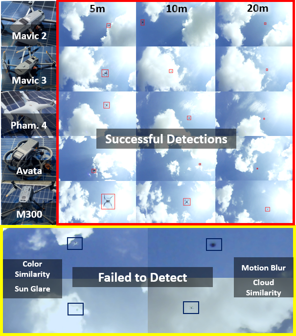

<p align="center">
    
</p>

# [MMAUD: A Comprehensive Multi-Modal Anti-UAV Dataset for Detection, Classification, Tracking and Trajectory Estimation of Compact Commercially Available Drones Threats](https://ntu-aris.github.io/MMAUD/)


This site presents the datasets collected from our research platform, featuring an extensive set of sensors:

* Two 3D lidars ( Conic LIDAR and Peripheral LIDAR)
* Two time-synchronized cameras
* One mmWave Radar
* Four Audio Array Nodes 

# Citation
If you use some resource from this data suite, please cite it as

```
@INPROCEEDINGS{yuan2024MMAUD,
  author={Yuan, Shenghai and Yang, Yizhuo and Nguyen, Thien Hoang and Nguyen, Thien-Minh and Yang, Jianfei and Liu, Fen and Li, Jianping and Wang, Han and Xie, Lihua},
  booktitle={2024 IEEE International Conference on Robotics and Automation (ICRA)}, 
  title={MMAUD: A Comprehensive Multi-Modal Anti-UAV Dataset for Modern Miniature Drone Threats}, 
  year={2024},
  pages={2745-2751},
  doi={10.1109/ICRA57147.2024.10610957}
}
```

# Downloads
<!--
Note: The files below are hosted on [NTU Data Repository](https://researchdata.ntu.edu.sg/dataset.xhtml?persistentId=doi:10.21979/N9/X39LEK).
If you experience interruption from the NTU Data Repository, please try downloading the files from this [Onedrive folder](https://entuedu-my.sharepoint.com/:f:/g/personal/shyuan_staff_main_ntu_edu_sg/EvyxXbi1l5tHonBWIQxueBoByr1-E-w7fgRyHNTsCmwFcg).

Ground truth is included in the separate bag. Do check out [this example](https://github.com/brytsknguyen/VINS-Mono/blob/392c8c5732d31445b266b9ca2e2f38a5a4d82d55/vins_estimator/launch/run_one_bag_ntuviral.sh#L68) on how to extract the data into the csv format.
-->

The files below are hosted on OneDrive. If you are having a problem downloading from one drive, do raise an issue. 
 
Note: All rosbag data has been compressed using 'rosbag compress' to reduce its size by a factor of 3. If you directly run 'rosbag play,' the playback frequency will be reduced. To restore the bag to its full rate, please use the 'rosbag decompress' command.


<a name="tab-download"></a>
<style type="text/css">
.tg  {border-collapse:collapse;border-spacing:0;}
.tg td{border-color:black;border-style:solid;border-width:1px;font-family:Arial, sans-serif;font-size:14px;
  overflow:hidden;padding:10px 5px;word-break:normal;}
.tg th{border-color:black;border-style:solid;border-width:1px;font-family:Arial, sans-serif;font-size:14px;
  font-weight:normal;overflow:hidden;padding:10px 5px;word-break:normal;}
.tg .tg-6ibf{border-color:inherit;font-size:18px;text-align:center;vertical-align:top}
.tg .tg-v8dz{border-color:inherit;font-size:18px;text-align:left;vertical-align:top}
.tg .tg-9m02{border-color:inherit;color:#00E;font-size:18px;text-align:center;text-decoration:underline;vertical-align:top}
</style>
<table class="tg">
<thead>
  <tr>
    <th class="tg-6ibf">Name</th>
    <th class="tg-6ibf">ROSBag Data</th>
    <th class="tg-6ibf">Folder Data</th>
    <th class="tg-6ibf">Ground truth</th>
    <th class="tg-6ibf">Size</th>
    <th class="tg-6ibf">Duration</th>
    <th class="tg-6ibf">Remark</th>
  </tr>
</thead>
<tbody>
  <tr>
    <td class="tg-v8dz">DJI Mavic2</td>
    <td class="tg-6ibf"><a href="https://entuedu-my.sharepoint.com/:u:/g/personal/shyuan_staff_main_ntu_edu_sg/Eb-_jzBSOhpNquYUpcZZeyEB4jf-35RJEkUYMZVj80WMiw?e=FBn0q9" target="_blank" rel="noopener noreferrer">.bag</a></td>
    <td class="tg-9m02"><a href="https://entuedu-my.sharepoint.com/:u:/g/personal/shyuan_staff_main_ntu_edu_sg/ESfINWq7uCpKkjH3YhEGZ24BmyKhcgFfF09dTZYte-C-0g?e=mww8va" target="_blank" rel="noopener noreferrer">.zip</a></td>
    <td class="tg-6ibf"><a href="https://entuedu-my.sharepoint.com/:u:/g/personal/shyuan_staff_main_ntu_edu_sg/EW4eZm1eEm9FndMN8hxQyesBNdQny6iV_n86Jtwcysi7Lw?e=s8csWh" target="_blank" rel="noopener noreferrer">.bag</a></td>
    <td class="tg-6ibf">14.1 GB</td>
    <td class="tg-6ibf">198s</td>
    <td class="tg-v8dz">MMAUD V1 Rooftop Simple </td>
  </tr>
  <tr>
    <td class="tg-v8dz">DJI Mavic3</td>
    <td class="tg-9m02"><a href="https://entuedu-my.sharepoint.com/:u:/g/personal/shyuan_staff_main_ntu_edu_sg/EVqEQlvzM25Lm_q-W6G1wIsBrJWBj2O6mfLbLZ_SCkbb_w?e=EIWBxX" target="_blank" rel="noopener noreferrer">.bag</a></td>
    <td class="tg-9m02"><a href="https://entuedu-my.sharepoint.com/:u:/g/personal/shyuan_staff_main_ntu_edu_sg/ETe4YTM-IKdMnA11Q1Dv_PgBWGfQ38iwYoFpkFWthhfJsQ?e=CJU8JN" target="_blank" rel="noopener noreferrer">.zip</a></td>
    <td class="tg-6ibf"><a href="https://entuedu-my.sharepoint.com/:u:/g/personal/shyuan_staff_main_ntu_edu_sg/Eaol9EuQTZ5BmYffvBSo3kIB0DwKDcYstGvwg-Qrtnts4A?e=ZaJpsa" target="_blank" rel="noopener noreferrer">.bag</a></td>
    <td class="tg-6ibf">11.1 GB</td>
    <td class="tg-6ibf">321.1 s</td>
    <td class="tg-v8dz">MMAUD V1 Rooftop Simple</td>
  </tr>
  <tr>
    <td class="tg-v8dz">DJI Phantom4</td>
    <td class="tg-9m02"><a href="https://entuedu-my.sharepoint.com/:u:/g/personal/shyuan_staff_main_ntu_edu_sg/EUvtDQtIou5Otv4S1kFZ4ikBPCypxqpYSZ8onr5BCPpG8w?e=hlbBBz" target="_blank" rel="noopener noreferrer">.bag</a></td>
    <td class="tg-9m02"><a href="https://entuedu-my.sharepoint.com/:u:/g/personal/shyuan_staff_main_ntu_edu_sg/ERY9v7zK3hxLtxqHKVa8aDgBDSji1W_1LFeYiXN9FKJMnA?e=sTaDCI" target="_blank" rel="noopener noreferrer">.zip</a></td>
    <td class="tg-6ibf"><a href="https://entuedu-my.sharepoint.com/:u:/g/personal/shyuan_staff_main_ntu_edu_sg/EYlHSi2RmehBoPYDXiKspL0BsYx0IDXFtmG_UcFRl_AKBQ?e=B7KLP3" target="_blank" rel="noopener noreferrer">.bag</a></td>
    <td class="tg-6ibf">13.2 GB</td>
    <td class="tg-6ibf">181.4 s</td>
    <td class="tg-v8dz">MMAUD V1 Rooftop Simple</td>
  </tr>
  <tr>
    <td class="tg-v8dz">DJI Avata</td>
    <td class="tg-9m02"><a href="https://entuedu-my.sharepoint.com/:u:/g/personal/shyuan_staff_main_ntu_edu_sg/ETqBudcomxlMn_ClHROwLLAB_5XP5t_elNcU2B7siU-1RQ?e=bYrzOi" target="_blank" rel="noopener noreferrer">.bag</a></td>
    <td class="tg-9m02"><a href="https://entuedu-my.sharepoint.com/:u:/g/personal/shyuan_staff_main_ntu_edu_sg/EU-kJE4eYctGkb6VOif4JEwBwSRjUpcWjFaDc4D-v-mUrA?e=Uxpq5y" target="_blank" rel="noopener noreferrer">.zip</a></td>
    <td class="tg-6ibf"><a href="https://entuedu-my.sharepoint.com/:u:/g/personal/shyuan_staff_main_ntu_edu_sg/EYoZq-lAmvVMgncDhDX4MDIBy6_mqqobYE1WW8xQ7EhfxQ?e=QJqwJc" target="_blank" rel="noopener noreferrer">.bag</a></td>
    <td class="tg-6ibf">19.7 GB</td>
    <td class="tg-6ibf">396.3 s</td>
    <td class="tg-v8dz">MMAUD V1 Rooftop Simple</td>
  </tr>
  <tr>
    <td class="tg-v8dz">DJI M300</td>
    <td class="tg-9m02"><a href="https://entuedu-my.sharepoint.com/:u:/g/personal/shyuan_staff_main_ntu_edu_sg/EeA7KMRCRNBNvbP50UsPmJ0B0PEGEk71L6FpHkQSKncabQ?e=U90Es9" target="_blank" rel="noopener noreferrer">.bag</a></td>
    <td class="tg-9m02"><a href="https://entuedu-my.sharepoint.com/:u:/g/personal/shyuan_staff_main_ntu_edu_sg/EacBt-X3QERBvH0Gw1d3kbMB7VECC1ATgSZHWFYzuUjGuA?e=nmBbUg" target="_blank" rel="noopener noreferrer">.zip</a></td>
    <td class="tg-6ibf"><a href="https://entuedu-my.sharepoint.com/:u:/g/personal/shyuan_staff_main_ntu_edu_sg/ERDR8BNyj0hBrmsCIg8rP8wBnmz52qq4WTqjkCc2dnUQAw?e=KkXYhl" target="_blank" rel="noopener noreferrer">.bag</a></td>
    <td class="tg-6ibf">14.4 GB</td>
    <td class="tg-6ibf">428.7 s</td>
    <td class="tg-v8dz">MMAUD V1 Rooftop Simple</td>
  </tr>


  <tr>
    <td class="tg-v8dz">DJI Mavic3</td>
    <td class="tg-9m02"><a href=" " target="_blank" rel="noopener noreferrer">.bag</a></td>
    <td class="tg-9m02"><a href="https://drive.google.com/drive/folders/1wk-c5xVX6701WNI_In1ba3_D4LSjRYv5" target="_blank" rel="noopener noreferrer">.zip</a></td>
    <td class="tg-6ibf"><a href=" " target="_blank" rel="noopener noreferrer">.bag</a></td>
    <td class="tg-6ibf">?? GB</td>
    <td class="tg-6ibf">?? s</td>
    <td class="tg-v8dz">MMAUD V2 Carpark Hard</td>
  </tr>
  <tr>
    <td class="tg-v8dz">DJI Phantom4</td>
    <td class="tg-9m02"><a href=" " target="_blank" rel="noopener noreferrer">.bag</a></td>
    <td class="tg-9m02"><a href="https://drive.google.com/drive/folders/1wk-c5xVX6701WNI_In1ba3_D4LSjRYv5" target="_blank" rel="noopener noreferrer">.zip</a></td>
    <td class="tg-6ibf"><a href=" " target="_blank" rel="noopener noreferrer">.bag</a></td>
    <td class="tg-6ibf">?? GB</td>
    <td class="tg-6ibf">?? s</td>
    <td class="tg-v8dz">MMAUD V2 Carpark Hard</td>
  </tr>
  <tr>
    <td class="tg-v8dz">DJI Avata</td>
    <td class="tg-9m02"><a href=" " target="_blank" rel="noopener noreferrer">.bag</a></td>
    <td class="tg-9m02"><a href="https://drive.google.com/drive/folders/1wk-c5xVX6701WNI_In1ba3_D4LSjRYv5" target="_blank" rel="noopener noreferrer">.zip</a></td>
    <td class="tg-6ibf"><a href=" " target="_blank" rel="noopener noreferrer">.bag</a></td>
    <td class="tg-6ibf">?? GB</td>
    <td class="tg-6ibf">?? s</td>
    <td class="tg-v8dz">MMAUD V2 Carpark Hard</td>
  </tr>
  <tr>
    <td class="tg-v8dz">DJI M300</td>
    <td class="tg-9m02"><a href=" " target="_blank" rel="noopener noreferrer">.bag</a></td>
    <td class="tg-9m02"><a href="https://drive.google.com/drive/folders/1wk-c5xVX6701WNI_In1ba3_D4LSjRYv5" target="_blank" rel="noopener noreferrer">.zip</a></td>
    <td class="tg-6ibf"><a href=" " target="_blank" rel="noopener noreferrer">.bag</a></td>
    <td class="tg-6ibf">?? GB</td>
    <td class="tg-6ibf">?? s</td>
    <td class="tg-v8dz">MMAUD V2 Carpark Hard</td>
  </tr>


  <tr>
    <td class="tg-v8dz">DJI Mavic3</td>
    <td class="tg-9m02"><a href=" " target="_blank" rel="noopener noreferrer">.bag</a></td>
    <td class="tg-9m02"><a href="https://drive.google.com/drive/folders/1wk-c5xVX6701WNI_In1ba3_D4LSjRYv5" target="_blank" rel="noopener noreferrer">.zip</a></td>
    <td class="tg-6ibf"><a href=" " target="_blank" rel="noopener noreferrer">.bag</a></td>
    <td class="tg-6ibf">?? GB</td>
    <td class="tg-6ibf">?? s</td>
    <td class="tg-v8dz">MMAUD V3 Carpark Moderate</td>
  </tr>
  <tr>
    <td class="tg-v8dz">DJI Phantom4</td>
    <td class="tg-9m02"><a href=" " target="_blank" rel="noopener noreferrer">.bag</a></td>
    <td class="tg-9m02"><a href="https://drive.google.com/drive/folders/1wk-c5xVX6701WNI_In1ba3_D4LSjRYv5" target="_blank" rel="noopener noreferrer">.zip</a></td>
    <td class="tg-6ibf"><a href=" " target="_blank" rel="noopener noreferrer">.bag</a></td>
    <td class="tg-6ibf">?? GB</td>
    <td class="tg-6ibf">?? s</td>
    <td class="tg-v8dz">MMAUD V3 Carpark Moderate</td>
  </tr>
  <tr>
    <td class="tg-v8dz">DJI Avata</td>
    <td class="tg-9m02"><a href=" " target="_blank" rel="noopener noreferrer">.bag</a></td>
    <td class="tg-9m02"><a href="https://drive.google.com/drive/folders/1wk-c5xVX6701WNI_In1ba3_D4LSjRYv5" target="_blank" rel="noopener noreferrer">.zip</a></td>
    <td class="tg-6ibf"><a href=" " target="_blank" rel="noopener noreferrer">.bag</a></td>
    <td class="tg-6ibf">?? GB</td>
    <td class="tg-6ibf">?? s</td>
    <td class="tg-v8dz">MMAUD V3 Carpark Moderate</td>
  </tr>
  <tr>
    <td class="tg-v8dz">DJI M300</td>
    <td class="tg-9m02"><a href=" " target="_blank" rel="noopener noreferrer">.bag</a></td>
    <td class="tg-9m02"><a href="https://drive.google.com/drive/folders/1wk-c5xVX6701WNI_In1ba3_D4LSjRYv5" target="_blank" rel="noopener noreferrer">.zip</a></td>
    <td class="tg-6ibf"><a href=" " target="_blank" rel="noopener noreferrer">.bag</a></td>
    <td class="tg-6ibf">?? GB</td>
    <td class="tg-6ibf">?? s</td>
    <td class="tg-v8dz">MMAUD V3 Carpark Moderate</td>
  </tr>
    
</tbody>
</table>

<p align="center">
    
</p>


V2 and V3 were used for the CVPR UG2+ challenge, which is more challenging than V1. V1 mostly flies below 30m, while V2 and V3 are designed for actual warfare simulation, reaching up to 100m. UAV Precision hits are unlikely to go beyond 100m. The results of the UG2 CVPR 2024 challenge are now available.

# Calibration Data

For calibration data, please refer to the google drive fisheye_calibration.zip  https://drive.google.com/drive/folders/1wk-c5xVX6701WNI_In1ba3_D4LSjRYv5

# Quick use

We have done some experiments of state-of-the-art methods on our the datasets. If you are seeking to do the same, please check out the following to get the work done quickly.

### Remark: The 2D detection baseline is considered too trivial to be provided separately. Interested party can download the data here https://drive.google.com/drive/folders/1_LpPyIfETQS-k2vlSsbzI9pzyVzZScSx?usp=sharing. Then follow the official code of yolov5 to train the model: https://github.com/ultralytics/yolov5. For rest of other 2D detection pipelines, it should be similar.

<p align="center">
    
</p>
<p align="center">
    
</p>

<style type="text/css">
.tg  {border-collapse:collapse;border-spacing:0;}
.tg td{border-color:black;border-style:solid;border-width:1px;font-family:Arial, sans-serif;font-size:14px;
  overflow:hidden;padding:10px 5px;word-break:normal;}
.tg th{border-color:black;border-style:solid;border-width:1px;font-family:Arial, sans-serif;font-size:14px;
  font-weight:normal;overflow:hidden;padding:10px 5px;word-break:normal;}
.tg .tg-c3ow{border-color:inherit;text-align:center;vertical-align:top}
.tg .tg-0pky{border-color:inherit;text-align:left;vertical-align:top}
</style>
<table class="tg">
<thead>
  <tr>
    <th class="tg-c3ow">3D Pose Estimation</th>
    <th class="tg-c3ow">Repository</th>
    <th class="tg-c3ow">Remark</th>
  </tr>
</thead>
<tbody>
  <tr>
    <td class="tg-0pky">ResNet</td>
    <td class="tg-0pky"> <a href="https://github.com/yizhuoyang/AV-FDTI/blob/main/nets/comparison/resnet50_visual.py"><span style="color:#905">ResNet</span></a></td>
    <td class="tg-0pky">Visual-Only/Supervised</td>
  </tr>
  <tr>
    <td class="tg-0pky">Darknet</td>
    <td class="tg-0pky"> <a href="https://github.com/yizhuoyang/AV-FDTI/blob/main/nets/comparison/darknet.py"><span style="color:#905">Darknet</span></a></td>
    <td class="tg-0pky">Visual-Only/Supervised</td>
  </tr>

  <tr>
    <td class="tg-0pky">VorasNet</td>
    <td class="tg-0pky"> <a href="https://github.com/yizhuoyang/AV-FDTI/blob/main/nets/comparison/voranet.py"><span style="color:#905">DroneChase</span></a></td>
    <td class="tg-0pky">Audio-Only/Supervised</td>
  </tr>
  <tr>
    <td class="tg-0pky">AV-PED</td>
    <td class="tg-0pky"> <a href="https://github.com/yizhuoyang/AV-FDTI/blob/main/nets/comparison/avped.py"><span style="color:#905">AV-PED</span></a></td>
    <td class="tg-0pky">Audio-Visual/Self-Supervised</td>
  </tr>
  <tr>
    <td class="tg-0pky">Audionet</td>
    <td class="tg-0pky"> <a href="https://github.com/yizhuoyang/AV-FDTI/blob/main/nets/comparison/audionet.py"><span style="color:#905">Audionet</span></a></td>
    <td class="tg-0pky">Audio-Only/Supervised</td>
  </tr>
  <tr>
    <td class="tg-0pky">AV-FDTI</td>
    <td class="tg-0pky"> <a href="https://github.com/yizhuoyang/AV-FDTI/"><span style="color:#905">AV-FDTI</span></a></td>
    <td class="tg-0pky">Audio-Visual/Supervised</td>
  </tr>
  <tr>
    <td class="tg-0pky">TAME</td>
    <td class="tg-0pky"> <a href="https://github.com/AmazingDay1/TAME"><span style="color:#905">TAME</span></a></td>
    <td class="tg-0pky">Audio-Only/Self-Supervised</td>
  </tr>
  <tr>
    <td class="tg-0pky">AAUTE</td>
    <td class="tg-0pky"> <a href="https://github.com/AllenLei666/AAUTE"><span style="color:#905">AAUTE</span></a></td>
    <td class="tg-0pky">Audio-Only/Self-Supervised</td>
  </tr>
  <tr>
    <td class="tg-0pky">UnLiDAR</td>
    <td class="tg-0pky"> <a href="https://github.com/lianghanfang/UnLiDAR-UAV-Est"><span style="color:#905">UnLiDAR</span></a></td>
    <td class="tg-0pky">LiDAR-Only/Unsupervised</td>
  </tr>
  <tr>
    <td class="tg-0pky">MMUDCT</td>
    <td class="tg-0pky"> <a href="https://github.com/dtc111111/Multi-Modal-UAV"><span style="color:#905">MMUDCT</span></a></td>
    <td class="tg-0pky">LiDAR-Visual/Unsupervised</td>
  </tr>
   <tr>
    <td class="tg-0pky">AV-DTEC</td>
    <td class="tg-0pky"> <a href="https://github.com/AmazingDay1/AV-DETC"><span style="color:#905">AV-DTEC</span></a></td>
    <td class="tg-0pky">LiDAR-Visual-Audio/Mamba/Self-Supervised</td>
  </tr>
</tbody>
</table>


# CAD drawing for dataset expansion


The [CAD drawing](https://github.com/ntu-aris/MMAUD/blob/gh-pages/drawing.rar) can be found here.

Since there are multiple Ethernet devices. It is recommended to set 2 livox lidar and MMwave radar to be at 192.168.10.xx , 192.168.11.xx , and 192.168.12.xx.

The microphone and camera can be obtained from Taobao. Whereas other LIDAR and RADAR systems need to find a local distributor to get them. 

If you have any issues in recreating this rig, feel free to drop an issue in this dataset repo

Calibration Info can be found here


### Equipment Procurement for Dataset Reproduction

Most of the required devices are commercially available and can be sourced from platforms such as **Taobao** or other regional suppliers. Below is an approximate cost breakdown:

- **Stereo Camera**: Approximately **USD $110**
- **Microphone Array**: Approximately **USD $90**
- **Livox Avia LiDAR**: Around **USD $1,500**
- **Livox Mid-360 LiDAR**: Approximately **USD $580**  
  _(Some users report sourcing it for as low as **USD $400+**, though specific vendor details may vary)_
- **Millimeter-Wave Radar**: Approximately **USD $3,700**  
  _(This was the most expensive component. However, we recommend considering alternative models with wider field-of-view coverage, as this unit offers only around **120° × 40°**, which may be limiting for certain applications.)_


> For more precise sourcing, we suggest contacting local distributors or authorized resellers who specialize in robotics and sensing equipment.
>
> 
# Notes:
For more information on the sensors and how to use the dataset, please checkout the other sections.

For resources and other works of our group, please check out our [github](https://github.com/ntu-aris).

If you have any inquiries, please raise an [issue](https://github.com/ntu-aris/MMAUD/issues) on GitHub.

# Licence
This work is licensed under a [Creative Commons Attribution-NonCommercial-ShareAlike 4.0 International License](https://creativecommons.org/licenses/by-nc-sa/4.0/) and is intended for non-commercial academic use.
If you are interested in using the dataset for commercial purposes, please [contact us](mailto:aris.eee.ntu@gmail.com).
